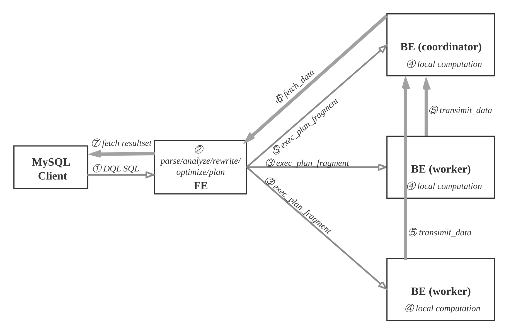
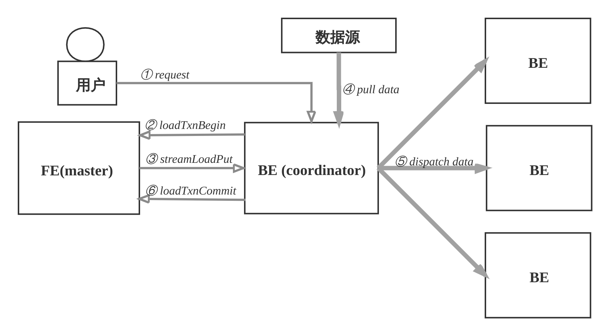
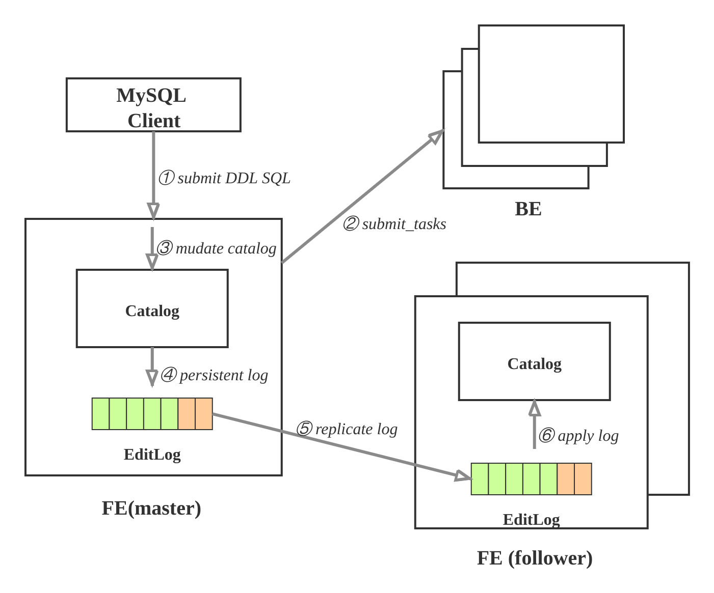
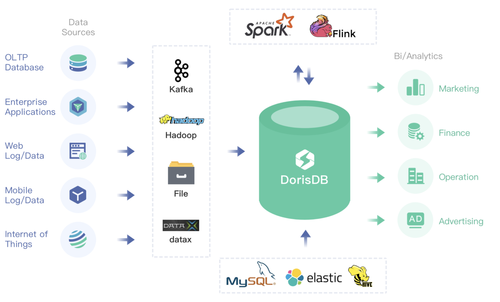

# 2. 快速开始


## 2.1 DorisDB基本概念

* FE：FrontEnd DorisDB的前端节点，负责管理元数据，管理客户端连接，进行查询规划，查询调度等工作。
* BE：BackEnd DorisDB的后端节点，负责数据存储，计算执行，以及compaction，副本管理等工作。
* Broker：DorisDB中和外部HDFS/对象存储等外部数据对接的中转服务，辅助提供导入导出功能。
* DorisManager：DorisDB 管理工具，提供DorisDB集群管理、在线查询、故障查询、监控报警的可视化工具。
* Tablet：DorisDB 表的逻辑分片，也是DorisDB中副本管理的基本单位，每个表根据分区和分桶机制被划分成多个Tablet存储在不同BE节点上。


## 2.2 DorisDB的系统架构

\[TOC\]

### 2.2.1 系统架构图


### 2.2.2 组件介绍

DorisDB集群由FE和BE构成, 可以使用MySQL客户端访问DorisDB集群。

**FE**

FE接收MySQL客户端的连接, 解析并执行SQL语句。

* 管理元数据, 执行SQL DDL命令, 用Catalog记录库, 表, 分区, tablet副本等信息。
* FE高可用部署, 使用复制协议选主和主从同步元数据, 所有的元数据修改操作, 由FE leader节点完成, FE follower节点可执行读操作。 元数据的读写满足顺序一致性。  FE的节点数目采用2n+1, 可容忍n个节点故障。  当FE leader故障时, 从现有的follower节点重新选主, 完成故障切换。
* FE的SQL layer对用户提交的SQL进行解析, 分析, 改写, 语义分析和关系代数优化, 生产逻辑执行计划。
* FE的Planner负责把逻辑计划转化为可分布式执行的物理计划, 分发给一组BE。
* FE监督BE, 管理BE的上下线, 根据BE的存活和健康状态, 维持tablet副本的数量。
* FE协调数据导入, 保证数据导入的一致性。

**BE**

* BE管理tablet副本, tablet是table经过分区分桶形成的子表, 采用列式存储。
* BE受FE指导, 创建或删除子表。
* BE接收FE分发的物理执行计划并指定BE coordinator节点, 在BE coordinator的调度下, 与其他BE worker共同协作完成执行。
* BE读本地的列存储引擎获取数据,并通过索引和谓词下沉快速过滤数据。
* BE后台执行compact任务, 减少查询时的读放大。
* 数据导入时, 由FE指定BE coordinator, 将数据以fanout的形式写入到tablet多副本所在的BE上。

**其他组件**

* 管理平台, 在后面会专门的章节介绍。
* Hdfs Broker:  用于从Hdfs中导入数据到DorisDB集群，见[数据导入](../4.-shu-ju-dao-ru/)章节。


## 2.3 DorisDB的手动部署

\[TOC\] 手动部署可以让用户快速体验DorisDB, 积累DorisDB的系统运维经验. 生产环境部署, 请使用管理平台和自动部署.

### 2.3.1 获取二进制产品包

请您联系DorisDB的技术支持或者销售人员获取最新稳定版的DorisDB二进制产品包.

比如您获得的产品包为dorisdb-1.0.0.tar.gz, 解压\(tar -xzvf dorisdb-1.0.0.tar.gz\)后内容如下:

DorisDB-XX-1.0.0

├── be \# BE目录

│ ├── bin

│ │ ├── start\_be.sh \# BE启动命令

│ │ └── stop\_be.sh \# BE关闭命令

│ ├── conf

│ │ └── be.conf \# BE配置文件

│ ├── lib

│ │ ├── dorisdb\_be \# BE可执行文件

│ │ └── meta\_tool

│ └── www

├── fe \# FE目录

│ ├── bin

│ │ ├── start\_fe.sh \# FE启动命令

│ │ └── stop\_fe.sh \# FE关闭命令

│ ├── conf

│ │ └── fe.conf \# FE配置文件

│ ├── lib

│ │ ├── dorisdb-fe.jar \# FE jar包

│ │ └── \*.jar \# FE 依赖的jar包

│ └── webroot

└── udf

### 2.3.2 环境准备

准备三台物理机, 需要以下环境支持：

* Linux \(Centos 7+\)
* Java 1.8+

CPU需要支持AVX2指令集， cat /proc/cpuinfo \|grep avx2有结果输出表明CPU支持，如果不支持建议找合适的机器进行部署测试，DorisDB使用向量化技术需要一定的指令集支持才能发挥效果。

将DorisDB的二进制产品包分发到目标主机的部署路径并解压，可以考虑使用新建的DorisDB用户来管理。

### 2.3.3 部署FE

#### 2.3.3.1 FE的基本配置

FE的配置文件为DorisDB-XX-1.0.0/fe/conf/fe.conf, 默认配置已经足以启动集群, 有经验的用户可以查看手册的系统配置章节, 为生产环境定制配置，为了让用户更好的理解集群的工作原理, 此处只列出基础配置.

#### 2.3.3.2 FE单实例部署

cd DorisDB-XX-1.0.0/fe

第一步: 定制配置文件conf/fe.conf：

```text
JAVA_OPTS = "-Xmx4096m -XX:+UseMembar -XX:SurvivorRatio=8 -XX:MaxTenuringThreshold=7 -XX:+PrintGCDateStamps -XX:+PrintGCDetails -XX:+UseConcMarkSweepGC -XX:+UseParNewGC -XX:+CMSClassUnloadingEnabled -XX:-CMSParallelRemarkEnabled -XX:CMSInitiatingOccupancyFraction=80 -XX:SoftRefLRUPolicyMSPerMB=0 -Xloggc:$DORIS_HOME/log/fe.gc.log"
```

可以根据FE内存大小调整 -Xmx4096m，为了避免GC建议16G以上，DorisDB的元数据都在内存中保存。

第二步: 创建元数据目录:

mkdir -p doris-meta

第三步: 启动FE进程:

bin/start\_fe.sh --daemon

第四步: 确认启动FE启动成功.

* 查看日志log/fe.log确认.

2020-03-16 20:32:14,686 INFO 1 \[FeServer.start\(\):46\] thrift server started.

2020-03-16 20:32:14,696 INFO 1 \[NMysqlServer.start\(\):71\] Open mysql server success on 9030

2020-03-16 20:32:14,696 INFO 1 \[QeService.start\(\):60\] QE service start.

2020-03-16 20:32:14,825 INFO 76 \[HttpServer$HttpServerThread.run\(\):210\] HttpServer started with port 8030

...

* 如果FE启动失败，可能是由于端口号被占用，修改配置文件conf/fe.conf中的端口号http\_port。
* 使用jps命令查看java进程确认"DorisDbFe"存在.
* 使用浏览器访问8030端口, 打开DorisDB的WebUI, 用户名为root, 密码为空.

#### 2.3.3.3 使用MySQL客户端访问FE

第一步: 安装mysql客户端\(如果已经安装，可忽略此步\)：

Ubuntu：sudo apt-get install mysql

Centos：sudo yum install mysql-client

第二步: 使用mysql客户端连接：

mysql -h 127.0.0.1 -P9030 -uroot

注意：这里默认root用户密码为空，端口为fe/conf/fe.conf中的query\_port配置项，默认为9030

第三步: 查看FE状态：

mysql&gt; SHOW PROC '/frontends'\G

_**1. row**_

Name: 172.16.139.24\_9010\_1594200991015

IP: 172.16.139.24

HostName: doris-sandbox01

EditLogPort: 9010

HttpPort: 8030

QueryPort: 9030

RpcPort: 9020

Role: FOLLOWER

IsMaster: true

ClusterId: 861797858

Join: true

Alive: true

ReplayedJournalId: 64

LastHeartbeat: 2020-03-23 20:15:07

IsHelper: true

ErrMsg:

1 row in set \(0.03 sec\)

Role为FOLLOWER说明这是一个能参与选主的FE；IsMaster为true，说明该FE当前为主节点。

如果MySQL客户端连接不成功，请查看log/fe.warn.log日志文件，确认问题。由于是初次启动，如果在操作过程中遇到任何意外问题，都可以删除并重新创建FE的元数据目录，再从头开始操作。

#### 2.3.3.4 FE的高可用集群部署

FE的高可用集群采用主从复制架构, 可避免FE单点故障. FE采用了类raft的bdbje协议完成选主, 日志复制和故障切换. 在FE集群中, 多实例分为两种角色: follower和observer; 前者为复制协议的可投票成员, 参与选主和提交日志, 一般数量为奇数\(2n+1\), 使用多数派\(n+1\)确认, 可容忍少数派\(n\)故障; 而后者属于非投票成员, 用于异步订阅复制日志, observer的状态落后于follower, 类似其他复制协议中的leaner角色.

FE集群从follower中自动选出master节点, 所有更改状态操作都由master节点执行, 从FE的master节点可以读到最新的状态. 更改操作可以从非master节点发起, 继而转发给master节点执行, 非master节点记录最近一次更改操作在复制日志中的LSN, 读操作可以直接在非master节点上执行, 但需要等待非master节点的状态已经同步到最近一次更改操作的LSN, 因此读写非Master节点满足顺序一致性. Observer节点能够增加FE集群的读负载能力, 时效性要求放宽的非紧要用户可以读observer节点.

FE节点之间的时钟相差不能超过5s, 使用NTP协议校准时间.

一台机器上只可以部署单个FE节点。所有FE节点的http\_port需要相同。

集群部署按照下列步骤逐个增加FE实例.

第一步: 分发二进制和配置文件, 配置文件和单实例情形相同.

第二步: 使用MySQL客户端连接已有的FE, 添加新实例的信息，信息包括角色、ip、port：

mysql&gt; ALTER SYSTEM ADD FOLLOWER "host:port";

或

mysql&gt; ALTER SYSTEM ADD OBSERVER "host:port";

host为机器的IP，如果机器存在多个IP，需要选取priority\_networks里的IP，例如priority\_networks=192.168.1.0/24 可以设置使用192.168.1.x 这个子网进行通信。port为edit\_log\_port，默认为9010。

> DorisDB的FE和BE因为安全考虑都只会监听一个IP来进行通信，如果一台机器有多块网卡，可能DorisDB无法自动找到正确的IP，例如 ifconfig 命令能看到 eth0 ip为 192.168.1.1, docker0: 172.17.0.1 ，我们可以设置 192.168.1.0/24 这一个字网来指定使用eth0作为通信的IP，这里采用是[CIDR](https://en.wikipedia.org/wiki/Classless_Inter-Domain_Routing)的表示方法来指定IP所在子网范围，这样可以在所有的BE，FE上使用相同的配置。 priority\_networks 是 FE 和 BE 相同的配置项，写在 fe.conf 和 be.conf 中。该配置项用于在 FE 或 BE 启动时，告诉进程应该绑定哪个IP。示例如下： `priority_networks=10.1.3.0/24`

如出现错误，需要删除FE，应用下列命令：

```text
alter system drop follower "fe_host:edit_log_port";
alter system drop observer "fe_host:edit_log_port";
```

具体参考[扩容缩容](None)。   


第三步: FE节点之间需要两两互联才能完成复制协议选主, 投票，日志提交和复制等功能。 FE节点首次启动时，需要指定现有集群中的一个节点作为helper节点, 从该节点获得集群的所有FE节点的配置信息，才能建立通信连接，因此首次启动需要指定--helper参数：

$ bin/start\_fe.sh --helper host:port --daemon

host为helper节点的IP，如果有多个IP，需要选取priority\_networks里的IP。port为edit\_log\_port，默认为9010。

当FE再次启动时，无须指定--helper参数， 因为FE已经将其他FE的配置信息存储于本地目录, 因此可直接启动：

./bin/start\_fe.sh --daemon

第四步: 查看集群状态, 确认部署成功：

mysql&gt; SHOW PROC '/frontends'\G

_**1. row**_

Name: 172.26.108.172\_9010\_1584965098874

IP: 172.26.108.172

HostName: doris-sandbox01

......

Role: FOLLOWER

IsMaster: true

......

Alive: true

......

_**2. row**_

Name: 172.26.108.174\_9010\_1584965098874

IP: 172.26.108.174

HostName: doris-sandbox02

......

Role: FOLLOWER

IsMaster: false

......

Alive: true

......

_**3. row**_

Name: 172.26.108.175\_9010\_1584965098874

IP: 172.26.108.175

HostName: doris-sandbox03

......

Role: FOLLOWER

IsMaster: false

......

Alive: true

......

3 rows in set \(0.05 sec\)

节点的Alive显示为true则说明添加节点成功。以上例子中，

172.26.108.172\_9010\_1584965098874 为主FE节点。

### 2.3.4 部署BE

#### 2.3.4.1 BE的基本配置

BE的配置文件为DorisDB-XX-1.0.0/be/conf/be.conf, 默认配置已经足以启动集群, 不建议初尝用户修改配置, 有经验的用户可以查看手册的系统配置章节, 为生产环境定制配置. 为了让用户更好的理解集群的工作原理, 此处只列出基础配置.

#### 2.3.4.2 BE部署

用户可使用下面命令添加BE到DorisDB集群, 一般至少部署3个BE实例, 每个实例的添加步骤相同.

cd DorisDB-XX-1.0.0/be

第一步: 创建数据目录：

mkdir -p storage

第二步: 通过mysql客户端添加BE节点：

mysql&gt; ALTER SYSTEM ADD BACKEND "host:port";

这里IP地址为和priority\_networks设置匹配的IP，portheartbeat\_service\_port，默认为9050

如出现错误，需要删除BE节点，应用下列命令：

* `alter system decommission backend "be_host:be_heartbeat_service_port";`
* `alter system dropp backend "be_host:be_heartbeat_service_port";`

具体参考[扩容缩容](None)。

第三步: 启动BE：

bin/start\_be.sh --daemon

第四步: 查看BE状态, 确认BE就绪:

mysql&gt; SHOW PROC '/backends'\G

_**1. row**_

BackendId: 10002

Cluster: default\_cluster

IP: 172.16.139.24

HostName: doris-sandbox01

HeartbeatPort: 9050

BePort: 9060

HttpPort: 8040

BrpcPort: 8060

LastStartTime: 2020-03-23 20:19:07

LastHeartbeat: 2020-03-23 20:34:49

Alive: true

SystemDecommissioned: false

ClusterDecommissioned: false

TabletNum: 0

DataUsedCapacity: .000

AvailCapacity: 327.292 GB

TotalCapacity: 450.905 GB

UsedPct: 27.41 %

MaxDiskUsedPct: 27.41 %

ErrMsg:

Version:

1 row in set \(0.01 sec\)

如果isAlive为true，则说明BE正常接入集群。如果BE没有正常接入集群，请查看log目录下的be.WARNING日志文件确定原因。

如果日志中出现类似以下的信息，说明priority\_networks的配置存在问题。

W0708 17:16:27.308156 11473 heartbeat\_server.cpp:82\] backend ip saved in master does not equal to backend local ip127.0.0.1 vs. 172.16.179.26

此时需要，先用以下命令drop掉原来加进去的be，然后重新以正确的IP添加BE。

mysql&gt; ALTER SYSTEM DROP BACKEND "172.16.139.24:9050";

由于是初次启动，如果在操作过程中遇到任何意外问题，都可以删除并重新创建storage目录，再从头开始操作。

### 2.3.5 部署Broker

配置文件为apache\_hdfs\_broker/conf/apache\_hdfs\_broker.conf

> 注意：如果机器有多个IP，需要配置priority\_networks，方式同FE。

如果有特殊的hdfs配置，复制线上的hdfs-site.xml到conf目录下

启动：

```text
./apache_hdfs_broker/bin/start_broker.sh --daemon
```

添加broker节点到集群中：

```text
MySQL> ALTER SYSTEM ADD BROKER broker1 "172.16.139.24:8000";
```

查看broker状态：

```text
MySQL> SHOW PROC "/brokers"\G
*************************** 1. row ***************************
          Name: broker1
            IP: 172.16.139.24
          Port: 8000
         Alive: true
 LastStartTime: 2020-04-01 19:08:35
LastUpdateTime: 2020-04-01 19:08:45
        ErrMsg: 
1 row in set (0.00 sec)
```

Alive为true代表状态正常。

### 2.3.6 参数设置

* **Swappiness**

关闭交换区，消除交换内存到虚拟内存时对性能的扰动。

```text
echo 0 | sudo tee /proc/sys/vm/swappiness
```

* **Compaction相关**

当使用聚合表或更新模型，导入数据比较快的时候，可改下列参数以加速compaction。

```text
cumulative_compaction_num_threads_per_disk = 4
base_compaction_num_threads_per_disk = 2
cumulative_compaction_check_interval_seconds = 2
```

* **并行度**

在客户端执行命令，修改DorisDB的并行度\(类似clickhouse set max\_threads= 8\)。并行度可以设置为当前机器CPU核数的一半。

```text
set  global parallel_fragment_exec_instance_num =  8;
```

### 2.3.7 使用MySQL客户端访问DorisDB

**1 Root用户登录**

使用MySQL客户端连接某一个FE实例的query\_port\(9030\), DorisDB内置root用户，密码默认为空：

mysql -h fe\_host -P9030 -u root

清理环境：

mysql &gt; drop database if exists example\_db;

mysql &gt; drop user test;

**2 创建新用户**

通过下面的命令创建一个普通用户：

mysql &gt; create user 'test' identified by '123456';

**3 创建数据库**

DorisDB中root账户才有权建立数据库，使用root用户登录，建立example\_db数据库:

mysql &gt; create database example\_db;

数据库创建完成之后，可以通过show databases查看数据库信息：

mysql &gt; show databases;

+--------------------+

\| Database \|

+--------------------+

\| example\_db \|

\| information\_schema \|

+--------------------+

2 rows in set \(0.00 sec\)

information\_schema是为了兼容mysql协议而存在，实际中信息可能不是很准确，所以关于具体数据库的信息建议通过直接查询相应数据库而获得。

**4 账户授权**

example\_db创建完成之后，可以通过root账户example\_db读写权限授权给test账户，授权之后采用test账户登录就可以操作example\_db数据库了：

mysql &gt; grant all on example\_db to test;

退出root账户，使用test登录DorisDB集群：

mysql &gt; exit

mysql -h 127.0.0.1 -P9030 -utest -p123456

**5 建表**

DorisDB支持支持单分区和复合分区两种建表方式。

在复合分区中：

* 第一级称为Partition，即分区。用户可以指定某一维度列作为分区列（当前只支持整型和时间类型的列），并指定每个分区的取值范围。
* 第二级称为Distribution，即分桶。用户可以指定某几个维度列（或不指定，即所有KEY列）以及桶数对数据进行HASH分布。

以下场景推荐使用复合分区：

* 有时间维度或类似带有有序值的维度：可以以这类维度列作为分区列。分区粒度可以根据导入频次、分区数据量等进行评估。
* 历史数据删除需求：如有删除历史数据的需求（比如仅保留最近N 天的数据）。使用复合分区，可以通过删除历史分区来达到目的。也可以通过在指定分区内发送DELETE语句进行数据删除。
* 解决数据倾斜问题：每个分区可以单独指定分桶数量。如按天分区，当每天的数据量差异很大时，可以通过指定分区的分桶数，合理划分不同分区的数据,分桶列建议选择区分度大的列。

用户也可以不使用复合分区，即使用单分区。则数据只做HASH分布。

下面分别演示两种分区的建表语句：

1. 首先切换数据库：mysql &gt; use example\_db;
2. 建立单分区表建立一个名字为table1的逻辑表。使用全hash分桶，分桶列为siteid，桶数为10。这个表的schema如下：
3. siteid：类型是INT（4字节）, 默认值为10
4. cidy\_code：类型是SMALLINT（2字节）
5. username：类型是VARCHAR, 最大长度为32, 默认值为空字符串
6. pv：类型是BIGINT（8字节）, 默认值是0; 这是一个指标列, DorisDB内部会对指标列做聚合操作, 这个列的聚合方法是求和（SUM）。这里采用了聚合模型，除此之外DorisDB还支持明细模型和更新模型，具体参考[数据模型介绍](None)。

建表语句如下:

```text
mysql >
CREATE TABLE table1
(
    siteid INT DEFAULT '10',
    citycode SMALLINT,
    username VARCHAR(32) DEFAULT '',
    pv BIGINT SUM DEFAULT '0'
)
AGGREGATE KEY(siteid, citycode, username)
DISTRIBUTED BY HASH(siteid) BUCKETS 10
PROPERTIES("replication_num" = "1");
```

1. 建立复合分区表

建立一个名字为table2的逻辑表。这个表的 schema 如下：

* event\_day：类型是DATE，无默认值
* siteid：类型是INT（4字节）, 默认值为10
* cidy\_code：类型是SMALLINT（2字节）
* username：类型是VARCHAR, 最大长度为32, 默认值为空字符串
* pv：类型是BIGINT（8字节）, 默认值是0; 这是一个指标列, DorisDB 内部会对指标列做聚合操作, 这个列的聚合方法是求和（SUM）

我们使用event\_day列作为分区列，建立3个分区: p1, p2, p3

* p1：范围为 \[最小值, 2017-06-30\)
* p2：范围为 \[2017-06-30, 2017-07-31\)
* p3：范围为 \[2017-07-31, 2017-08-31\)

每个分区使用siteid进行哈希分桶，桶数为10。

建表语句如下:

```text
mysql >
CREATE TABLE table2
(
event_day DATE,
siteid INT DEFAULT '10',
citycode SMALLINT,
username VARCHAR(32) DEFAULT ''
pv BIGINT SUM DEFAULT '0'
)
AGGREGATE KEY(event_day, siteid, citycode, username)
PARTITION BY RANGE(event_day)
(
PARTITION p1 VALUES LESS THAN ('2017-06-30'),
PARTITION p2 VALUES LESS THAN ('2017-07-31'),
PARTITION p3 VALUES LESS THAN ('2017-08-31')
)
DISTRIBUTED BY HASH(siteid) BUCKETS 10
PROPERTIES("replication_num" = "1");
```

表建完之后，可以查看example\_db中表的信息:

mysql&gt; show tables;

+----------------------+

\| Tables\_in\_example\_db \|

+----------------------+

\| table1 \|

\| table2 \|

+----------------------+

2 rows in set \(0.01 sec\)

mysql&gt; desc table1;

+----------+-------------+------+-------+---------+-------+

\| Field \| Type \| Null \| Key \| Default \| Extra \|

+----------+-------------+------+-------+---------+-------+

\| siteid \| int\(11\) \| Yes \| true \| 10 \| \|

\| citycode \| smallint\(6\) \| Yes \| true \| N/A \| \|

\| username \| varchar\(32\) \| Yes \| true \| \| \|

\| pv \| bigint\(20\) \| Yes \| false \| 0 \| SUM \|

+----------+-------------+------+-------+---------+-------+

4 rows in set \(0.00 sec\)

mysql&gt; desc table2;

+-----------+-------------+------+-------+---------+-------+

\| Field \| Type \| Null \| Key \| Default \| Extra \|

+-----------+-------------+------+-------+---------+-------+

\| event\_day \| date \| Yes \| true \| N/A \| \|

\| siteid \| int\(11\) \| Yes \| true \| 10 \| \|

\| citycode \| smallint\(6\) \| Yes \| true \| N/A \| \|

\| username \| varchar\(32\) \| Yes \| true \| \| \|

\| pv \| bigint\(20\) \| Yes \| false \| 0 \| SUM \|

+-----------+-------------+------+-------+---------+-------+

5 rows in set \(0.00 sec\)


## 2.4 数据流和控制流

\[TOC\]

### 2.4.1 查询

用户可使用MySQL客户端连接FE，执行SQL查询， 获得结果。

查询流程如下：

* ① MySQL客户端执行DQL SQL命令。
* ② FE解析, 分析, 改写, 优化和规划, 生成分布式执行计划。
* ③ 分布式执行计划由 若干个可在单台be上执行的plan fragment构成， FE执行exec\_plan\_fragment, 将plan fragment分发给BE，并指定其中一台BE为coordinator。
* ④ BE执行本地计算, 比如扫描数据。
* ⑤ 其他BE调用transimit\_data将中间结果发送给BE coordinator节点汇总为最终结果。
* ⑥ FE调用fetch\_data获取最终结果。
* ⑦ FE将最终结果发送给MySQL client。

执行计划在BE上的实际执行过程比较复杂, 采用向量化执行方式，比如一个算子产生4096个结果，输出到下一个算子参与计算，而非batch方式或者one-tuple-at-a-time。



### 2.4.2 数据导入

用户创建表之后, 导入数据填充表.

* 支持导入数据源有: 本地文件, HDFS, Kafka和S3.
* 支持导入方式有: 批量导入, 流式导入, 实时导入.
* 支持的数据格式有: CSV, Parquet, ORC等.
* 导入发起方式有: 用RESTful接口, 执行SQL命令.

数据导入的流程如下:

* ① 用户选择一台BE作为协调者, 发起数据导入请求, 传入数据格式, 数据源和标识此次数据导入的label, label用于避免数据重复导入. 用户也可以向FE发起请求, FE会把请求重定向给BE.
* ② BE收到请求后, 向FE master节点上报, 执行loadTxnBegin, 创建全局事务。 因为导入过程中, 需要同时更新base表和物化索引的多个bucket, 为了保证数据导入的一致性, 用事务控制本次导入的原子性.
* ③ BE创建事务成功后, 执行streamLoadPut调用, 从FE获得本次数据导入的计划. 数据导入, 可以看成是将数据分发到所涉及的全部的tablet副本上, BE从FE获取的导入计划包含数据的schema信息和tablet副本信息.
* ④ BE从数据源拉取数据, 根据base表和物化索引表的schema信息, 构造内部数据格式.
* ⑤ BE根据分区分桶的规则和副本位置信息, 将发往同一个BE的数据, 批量打包, 发送给BE, BE收到数据后, 将数据写入到对应的tablet副本中.
* ⑥ 当BE coordinator节点完成此次数据导入, 向FE master节点执行loadTxnCommit, 提交全局事务, 发送本次数据导入的 执行情况, FE master确认所有涉及的tablet的多数副本都成功完成, 则发布本次数据导入使数据对外可见, 否则, 导入失败, 数据不可见, 后台负责清理掉不一致的数据.



### 2.4.3 更改元数据

更改元数据的操作有: 创建数据库, 创建表, 创建物化视图, 修改schema等等. 这样的操作需要:

* 持久化到永久存储的设备上;
* 保证高可用, 复制FE多实例上, 避免单点故障;
* 有的操作需要在BE上生效, 比如创建表时, 需要在BE上创建tablet副本.

元数据的更新操作流程如下:

* ① 用户使用MySQL client执行SQL的DDL命令, 向FE的master节点发起请求; 比如: 创建表.
* ② FE检查请求合法性, 然后向BE发起同步命令, 使操作在BE上生效; 比如: FE确定表的列类型是否合法, 计算tablet的副本的放置位置, 向BE发起请求, 创建tablet副本.
* ③ BE执行成功, 则修改内存的Catalog. 比如: 将table, partition, index, tablet的副本信息保存在Catalog中.
* ④ FE追加本次操作到EditLog并且持久化.
* ⑤ FE通过复制协议将EditLog的新增操作项同步到FE的follower节点.
* ⑥ FE的follower节点收到新追加的操作项后, 在自己的Catalog上按顺序播放, 使得自己状态追上FE master节点.

上述执行环节出现失败, 则本次元数据修改失败.




## 2.5 数据导入和查询

\[TOC\]

### 2.5.1 本地文件导入

为适配不同的数据导入需求，DorisDB 系统提供了5种不同的导入方式，以支持不同的数据源（如HDFS、Kafka、本地文件等），或者按不同的方式（异步或同步）导入数据。

1. **Broker Load**

Broker Load 通过 Broker 进程访问并读取外部数据源，然后采用 MySQL 协议向 DorisDB 创建导入作业。

Broker Load适用于源数据在Broker进程可访问的存储系统（如HDFS）中，数据量为几十GB到上百GB。数据源有Hive等。

1. **Spark Load**

Spark Load 通过外部的 Spark 资源实现对导入数据的预处理，提高 DorisDB 大数据量的导入性能并且节省 DorisDB 集群的计算资源。

Spark Load适用于初次迁移大数据量（可到TB级别）到DorisDB的场景，且源数据在Spark可访问的存储系统（如HDFS）中。

1. **Stream Load**

Stream Load是一种同步执行的导入方式。用户通过 HTTP 协议发送请求将本地文件或数据流导入到 DorisDB中，并等待系统返回导入的结果状态，从而判断导入是否成功。

Stream Load适用于导入本地文件，或通过程序导入数据流中的数据。数据源有Flink、CSV等。

1. **Routine Load**

Routine Load（例行导入）提供了一种自动从指定数据源进行数据导入的功能。用户通过 MySQL 协议提交例行导入作业，生成一个常驻线程，不间断的从数据源（如 Kafka）中读取数据并导入到 DorisDB 中。

1. **Insert Into**

类似 MySQL 中的 Insert 语句，DorisDB 提供 INSERT INTO tbl SELECT ...; 的方式从 DorisDB 的表中读取数据并导入到另一张表。或者通过 INSERT INTO tbl VALUES\(...\); 插入单条数据。数据源有DataX/DTS、Kettle/Informatic、DorisDB本身。

DorisDB数据导入整体生态图如下。



具体导入方式详情请参考[数据导入](../4.-shu-ju-dao-ru/)。这里为了尽快导入测试数据，我们只介绍利用HTTP协议的Stream load方式导入。

* **示例1**：以 "table1\_20170707"为Label，使用本地文件table1\_data导入table1表。
* 在本地创建数据文件able1\_data，以\t作为数据之间的分隔符，具体内容如下：

```text
1        1        jim        2
2        1        grace      2
3        2        tom        2
4        3        bush       3
5        3        helen      3
```

利用curl命令封装HTTP请求，完成数据的导入

```text
curl --location-trusted -u test:123456 -T table1_data -H "label: table1_20170707" http://127.0.0.1:8030/api/example_db/table1/_stream_load
```

> 注意：这里test是fe的IP地址，端口8030是fe.conf中配置的http port。

* **示例2**: 以"table2\_20170707"为Label，使用本地文件table2\_data导入table2表。

在本地创建数据文件table2\_data，以\t作为数据之间的分隔，具体内容如下：

```text
2017-07-03        1        1        jim        2
2017-07-05        2        1        grace       2
2017-07-12        3        2        tom        2
2017-07-15        4        3        bush       3
```

利用curl命令封装HTTP请求，完成数据的导入

`curl --location-trusted -u test:123456 -T table2_data -H "label:table2_20170707" http://127.0.0.1:8030/api/example_db/table2/_stream_load`

### 2.5.2 查询

1. 简单查询

示例:

`mysql> select * from table1;`

`+--------+----------+----------+------+`

`| siteid | citycode | username | pv |`

`+--------+----------+----------+------+`

`| 5 | 3 | helen | 3 |`

`| 2 | 1 | grace | 2 |`

`| 1 | 1 | jim | 2 |`

`| 4 | 3 | bush | 3 |`

`| 3 | 2 | tom | 2 |`

`+--------+----------+----------+------+`

1. order by查询

示例:

`mysql> select * from table1 order by citycode;`

`+--------+----------+----------+------+`

`| siteid | citycode | username | pv |`

`+--------+----------+----------+------+`

`| 2 | 1 | grace | 2 |`

`| 1 | 1 | jim | 2 |`

`| 3 | 2 | tom | 2 |`

`| 4 | 3 | bush | 3 |`

`| 5 | 3 | helen | 3 |`

`+--------+----------+----------+------+`

`5 rows in set (0.07 sec)`

1. 带有join的查询

示例:

`mysql> select sum(table1.pv) from table1 join table2 where table1.siteid = table2.siteid;`

`+--------------------+`

`| sum(`table1`.`pv`) |`

`+--------------------+`

`| 12 |`

`+--------------------+`

`1 row in set (0.20 sec)`

1. 带有子查询的查询

示例:

`mysql> select sum(pv) from table2 where siteid in (select siteid from table1 where siteid > 2);`

`+-----------+`

`| sum(`pv`) |`

`+-----------+`

`| 8 |`

`+-----------+`

`1 row in set (0.13 sec)`

如果在DorisManager的编辑器中执行查询语句，可以查看Profile，Profile是BE执行后的结果，包含了每一个步骤的耗时和数据处理量等数据，可以通过DorisManager的图形界面看到可视化的Profile执行树。在DorisManager中执行查询，点击查询历史，就可看在“执行详情”tab中看到Profile的详细文本信息，在“执行时间”tab中能看到图形化的展示。详情见[8.8 查询分析](None)。

### 2.5.3 Schema修改

1. 修改Schema

使用ALTER TABLE命令可以修改表的Schema，包括如下修改：

`* 增加列`

`* 删除列`

`* 修改列类型`

`* 改变列顺序`

以下举例说明。

原表table1的Schema如下:

`+----------+-------------+------+-------+---------+-------+`

`| Field | Type| Null | Key | Default | Extra |`

`+----------+-------------+------+-------+---------+-------+`

`| siteid | int(11) | Yes | true | 10 | |`

`| citycode | smallint(6) | Yes | true | N/A | |`

`| username | varchar(32) | Yes | true | | |`

`| pv | bigint(20) | Yes | false | 0 | SUM |`

`+----------+-------------+------+-------+---------+-------+`

我们新增一列uv，类型为BIGINT，聚合类型为SUM，默认值为0:

`mysql > ALTER TABLE table1 ADD COLUMN uv BIGINT SUM DEFAULT '0' after pv;`

提交成功后，可以通过以下命令查看:

`mysql > SHOW ALTER TABLE COLUMN\G`

当作业状态为FINISHED，则表示作业完成。新的Schema 已生效。

ALTER TABLE完成之后, 可以通过desc table查看最新的schema：

`mysql> desc table1;`

`+----------+-------------+------+-------+---------+-------+`

`| Field | Type| Null | Key | Default | Extra |`

`+----------+-------------+------+-------+---------+-------+`

`| siteid | int(11) | Yes | true | 10 | |`

`| citycode | smallint(6) | Yes | true | N/A | |`

`| username | varchar(32) | Yes | true | | |`

`| pv | bigint(20) | Yes | false | 0 | SUM |`

`| uv | bigint(20) | Yes | false | 0 | SUM |`

`+----------+-------------+------+-------+---------+-------+`

`5 rows in set (0.00 sec)`

可以使用以下命令取消当前正在执行的作业:

`mysql > CANCEL ALTER TABLE COLUMN FROM table1\G`

1. 创建Rollup

Rollup是DorisDB使用的一种新型预计算加速技术，可以理解为基于基础表构建的一个物化索引结构。**物化**是因为其数据在物理上独立存储，而**索引**的意思是，Rollup可以调整列顺序以增加前缀索引的命中率，也可以减少key列以增加数据的聚合度。这里仅简单举例介绍，更多相关内容请参考相关章节。

原表table1的Schema如下:

`+----------+-------------+------+-------+---------+-------+`

`| Field | Type| Null | Key | Default | Extra |`

`+----------+-------------+------+-------+---------+-------+`

`| siteid | int(11) | Yes | true | 10 | |`

`| citycode | smallint(6) | Yes | true | N/A | |`

`| username | varchar(32) | Yes | true | | |`

`| pv | bigint(20) | Yes | false | 0 | SUM |`

`| uv | bigint(20) | Yes | false | 0 | SUM |`

`+----------+-------------+------+-------+---------+-------+`

对于table1明细数据是siteid, citycode, username三者构成一个key，从而对pv字段进行聚合；如果业务方经常有看城市pv总量的需求，可以建立一个只有citycode, pv的rollup：

`mysql > ALTER TABLE table1 ADD ROLLUP rollup_city(citycode, pv);`

提交成功后，可以通过以下命令查看:

`mysql > SHOW ALTER TABLE ROLLUP\G`

当作业状态为 FINISHED，则表示作业完成。

Rollup建立完成之后可以使用desc table1 all查看表的rollup信息：

`mysql> desc table1 all;`

`+-------------+----------+-------------+------+-------+--------+-------+`

`| IndexName | Field| Type | Null | Key | Default | Extra |`

`+-------------+----------+-------------+------+-------+---------+-------+`

`| table1 | siteid | int(11) | Yes| true | 10 | |`

`| | citycode | smallint(6) | Yes| true | N/A | |`

`| | username | varchar(32) | Yes| true | | |`

`| | pv | bigint(20) | Yes| false | 0 | SUM |`

`| | uv | bigint(20) | Yes| false | 0 | SUM |`

`| | | | | | | |`

`| rollup_city | citycode | smallint(6) | Yes| true | N/A | |`

`| | pv | bigint(20) | Yes| false | 0 | SUM |`

`+-------------+----------+-------------+------+-------+---------+-------+`

`8 rows in set (0.01 sec)`

可以使用以下命令取消当前正在执行的作业:

`mysql > CANCEL ALTER TABLE ROLLUP FROM table1;`


## 2.6 测试常见问题

\[TOC\]

测试过程中的常见问题：   


### 2.6.1 部署

#### 2.6.1 如何选择硬件和优化配置

**硬件选择**

* BE推荐16核64GB以上，FE推荐8核16GB以上。
* 磁盘可以使用HDD或者SSD。
* CPU需要支持AVX2指令集，`cat /proc/cpuinfo |grep avx2` 确认有输出即可，如果没有支持，建议更换机器，DorisDB的向量化技术需要CPU指令集支持才能发挥更好的效果。
* 网络需要万兆网卡和万兆交换机。

**参数配置**

* 参数配置参考 [8.3 配置参数](None)

### 2.6.2 建模

#### 2.6.2.1 如何合理地分区分桶

**如何分区**

* 通过合理的分区可以有效的裁剪scan的数据量。我们一般从数据的管理角度来选择分区键，选用**时间**或者区域作为分区键。
* 使用动态分区可以定期自动创建分区，比如每天创建出新的分区。

**如何分桶**

* 选择**高基数的列**来作为分桶键（如果有唯一ID就用这个列来作为 分桶键 即可），这样保证数据在各个bucket中尽可能均衡，如果碰到数据倾斜严重的数据可以使用多列作为分桶键（但一般不要太多）。
* 分桶的数量影响查询的并行度，最佳实践是计算一下数据存储量，将每个tablet设置成 100MB ~ 1GB 之间。
* 在机器比较少的情况下，如果想充分利用机器资源可以考虑使用 `BE数量 * cpu core / 2`来设置bucket数量。例如有100GB数据的一张表，有4台BE，每台64C，只有一个分区，那么可以采用 bucket数量 `4 * 64 /2  = 144`，这样每个tablet的数据也在694MB，同时也能充分利用CPU资源。

#### 2.6.2.2 排序键设计

* 排序键要根据查询的特点来设计。
* 将**经常作为过滤条件和group by的列作为排序键**可以加速查询。
* 如果是有**大量点查**，建议把查询点查的ID放到第一列。例如 查询主要类型是 `select sum(revenue) from lineorder where user_id='aaa100'`;  并且有很高的并发，强烈推荐把user\_id 作为排序键的第一列。
* 如果查询的主要是**聚合和scan比较多**，建议把低基数的列放在前面。例如 查询的主要类型是 `select region, nation, count(*)  from lineorder_flat group by region, nation`，把region作为第一列、nation作为第二列会更合适。低基数的列放在前面可以有助于数据局部性。

#### 2.6.2.3 合理选择数据类型

* 用尽量精确的类型。比如能够使用整形就不要用字符串类型，能够使用int就不要使用bigint，精确的数据类型能够更好的发挥数据库的性能。

### 2.6.3 查询

#### 2.6.3.1  如何合理地设置并行度

* 通过session变量   parallel\_fragment\_exec\_instance\_num  可以设置查询的并行度（单个 BE 内部的并行度），如果我们觉得查询性能不够好但是cpu资源充足可以通过 set parallel\_fragment\_exec\_instance\_num = 16; 来调整这里并行度可以 **设置成CPU核数量的一半** 。
* 通过set **global** parallel\_fragment\_exec\_instance\_num = 16; 可以让session变量全局有效。
* parallel\_fragment\_exec\_instance\_num 受到每个BE的tablet数量的影响，比如 一张表的bucket数量是 32, 有3个分区，分布在4个BE上，那么每个BE的tablet数量是 32 \* 3  / 4 = 24, 那么单机的并行度无法超过24，即使你set parallel\_fragment\_exec\_instance\_num = 32 ，但是实际执行的时候并行度还是会变成24。
* 对于需要进行高QPS查询的场景，因为机器整体资源是充分利用的，所以建议设置parallel\_fragment\_exec\_instance\_num为1，这样可以减少不同查询之间的资源竞争，反而整体可以提升QPS。

#### 2.6.3.2 如何查看Profile分析查询瓶颈

* 通过explain sql命令可以查看查询计划。
* 通过 set is\_report\_success = true 可以打开profile的上报。
* 标准版用户在 http:FE\_IP:FE\_HTTP\_PORT/queries 可以看到当前的查询和Profile信息
* 企业版用户在DorisDBManager的查询页面可以看到图形化的Profille展示
* Plan和Profile参考[查询分析](http://doc.dorisdb.com/2146379) 和[性能优化](http://doc.dorisdb.com/2146803)章节


## 2.7 下一步

* DorisDB高级使用技巧请参考"[Using DorisDB](../6.-shi-yong-dorisdb/)"
* 更多关于DorisDB的数据模型和建表请参考"[Table Design](../3.-biao-she-ji/)"
* 关于数据导入请参考"[数据导入](../4.-shu-ju-dao-ru/)"
* 关于查询语句和聚合函数请参考"[SQL Reference](../3.-biao-she-ji/)"


# 9. 性能测试

\[TOC\]

## 9.1 测试方法

为了方便用户快速的了解DorisDB的性能指标，这里我们提供了一个标准的Star schema benchmark的测试方法和工具仅供参考。

Star schema benchmark（以下简称SSB）是学术界和工业界广泛使用的一个星型模型测试集（来源[论文](https://www.cs.umb.edu/~xuedchen/research/publications/StarSchemaB.PDF)），通过这个测试集合也可以容易的和其他OLAP产品进行性能对比。

## 9.2 测试准备

### 9.2.1 环境准备

* 硬件环境准备，DorisDB对机器没有严格要求，建议大于8C 32G，磁盘是SSD/SATA均可，网络建议万兆网卡。
* 集群部署参考 [集群部署](None)
* 系统参数参考 [配置参数](None)
* 下载ssb-poc工具集

### 9.2.2 SSB SQL

```text
--Q1.1
select sum(lo_revenue) as revenue
from lineorder join dates on lo_orderdate = d_datekey
where d_year = 1993 and lo_discount between 1 and 3 and lo_quantity < 25;
--Q1.2
select sum(lo_revenue) as revenue
from lineorder
join dates on lo_orderdate = d_datekey
where d_yearmonthnum = 199401
and lo_discount between 4 and 6
and lo_quantity between 26 and 35;
--Q1.3
select sum(lo_revenue) as revenue
from lineorder
join dates on lo_orderdate = d_datekey
where d_weeknuminyear = 6 and d_year = 1994
and lo_discount between 5 and 7
and lo_quantity between 26 and 35;
--Q2.1
select sum(lo_revenue) as lo_revenue, d_year, p_brand
from lineorder
join dates on lo_orderdate = d_datekey
join part on lo_partkey = p_partkey
join supplier on lo_suppkey = s_suppkey
where p_category = 'MFGR#12' and s_region = 'AMERICA'
group by d_year, p_brand
order by d_year, p_brand;
--Q2.2
select sum(lo_revenue) as lo_revenue, d_year, p_brand
from lineorder
join dates on lo_orderdate = d_datekey
join part on lo_partkey = p_partkey
join supplier on lo_suppkey = s_suppkey
where p_brand between 'MFGR#2221' and 'MFGR#2228' and s_region = 'ASIA'
group by d_year, p_brand
order by d_year, p_brand;
--Q2.3
select sum(lo_revenue) as lo_revenue, d_year, p_brand
from lineorder
join dates on lo_orderdate = d_datekey
join part on lo_partkey = p_partkey
join supplier on lo_suppkey = s_suppkey
where p_brand = 'MFGR#2239' and s_region = 'EUROPE'
group by d_year, p_brand
order by d_year, p_brand;
--Q3.1
select c_nation, s_nation, d_year, sum(lo_revenue) as lo_revenue
from lineorder
join dates on lo_orderdate = d_datekey
join customer on lo_custkey = c_custkey
join supplier on lo_suppkey = s_suppkey
where c_region = 'ASIA' and s_region = 'ASIA'and d_year >= 1992 and d_year <= 1997
group by c_nation, s_nation, d_year
order by d_year asc, lo_revenue desc;
--Q3.2
select c_city, s_city, d_year, sum(lo_revenue) as lo_revenue
from lineorder
join dates on lo_orderdate = d_datekey
join customer on lo_custkey = c_custkey
join supplier on lo_suppkey = s_suppkey
where c_nation = 'UNITED STATES' and s_nation = 'UNITED STATES'
and d_year >= 1992 and d_year <= 1997
group by c_city, s_city, d_year
order by d_year asc, lo_revenue desc;
--Q3.3
select c_city, s_city, d_year, sum(lo_revenue) as lo_revenue
from lineorder
join dates on lo_orderdate = d_datekey
join customer on lo_custkey = c_custkey
join supplier on lo_suppkey = s_suppkey
where (c_city='UNITED KI1' or c_city='UNITED KI5')
and (s_city='UNITED KI1' or s_city='UNITED KI5')
and d_year >= 1992 and d_year <= 1997
group by c_city, s_city, d_year
order by d_year asc, lo_revenue desc;
--Q3.4
select c_city, s_city, d_year, sum(lo_revenue) as lo_revenue
from lineorder
join dates on lo_orderdate = d_datekey
join customer on lo_custkey = c_custkey
join supplier on lo_suppkey = s_suppkey
where (c_city='UNITED KI1' or c_city='UNITED KI5') and (s_city='UNITED KI1' or s_city='UNITED KI5') and d_yearmonth = 'Dec1997'
group by c_city, s_city, d_year
order by d_year asc, lo_revenue desc;
--Q4.1
select d_year, c_nation, sum(lo_revenue) - sum(lo_supplycost) as profit
from lineorder
join dates on lo_orderdate = d_datekey
join customer on lo_custkey = c_custkey
join supplier on lo_suppkey = s_suppkey
join part on lo_partkey = p_partkey
where c_region = 'AMERICA' and s_region = 'AMERICA' and (p_mfgr = 'MFGR#1' or p_mfgr = 'MFGR#2')
group by d_year, c_nation
order by d_year, c_nation;
--Q4.2
select d_year, s_nation, p_category, sum(lo_revenue) - sum(lo_supplycost) as profit
from lineorder
join dates on lo_orderdate = d_datekey
join customer on lo_custkey = c_custkey
join supplier on lo_suppkey = s_suppkey
join part on lo_partkey = p_partkey
where c_region = 'AMERICA'and s_region = 'AMERICA'
and (d_year = 1997 or d_year = 1998)
and (p_mfgr = 'MFGR#1' or p_mfgr = 'MFGR#2')
group by d_year, s_nation, p_category
order by d_year, s_nation, p_category;
--Q4.3
select d_year, s_city, p_brand, sum(lo_revenue) - sum(lo_supplycost) as profit
from lineorder
join dates on lo_orderdate = d_datekey
join customer on lo_custkey = c_custkey
join supplier on lo_suppkey = s_suppkey
join part on lo_partkey = p_partkey
where c_region = 'AMERICA'and s_nation = 'UNITED STATES'
and (d_year = 1997 or d_year = 1998)
and p_category = 'MFGR#14'
group by d_year, s_city, p_brand
order by d_year, s_city, p_brand;
```

## 9.3 测试流程

### 9.3.1 数据创建

#### 9.3.1.1 下载ssb-poc工具包并编译

```text
make && make install
```

所有相关工具安装到output目录

#### 9.3.1.2 生成数据

```text
bin/gen-ssb.sh 100 data_dir
```

#### 9.3.1.3  建表

建表中有三个注意事项，这几个选择会比较大的影响到测试结果：

1. Bucket的数量选择和分桶键的选择

Bucket的数量是对性能影响比较大的因素之一，首先我们希望选择合理的分桶键（DISTRIBUTED BY HASH\(key\)\)，来保证数据在各个bucket中尽可能均衡，如果碰到数据倾斜严重的数据可以使用多列作为分桶键，或者采用MD5 hash以后作为分桶键，具体可以参考[分桶键选择](None)，这里我们都统一使用唯一的key列。

1. 建表的数据类型

数据类型的选择对性能测试的结果是有一定影响的，比如Decimal/String的运算一般比int/bigint要慢，所以在实际场景中我们应该尽可能准确的使用数据类型，从而达到最好的效果，比如可以使用Int/Bigint的字段就尽量避免使用String，如果是日期类型也多使用Date/Datetime以及相对应的时间日期函数，而不是用string和相关字符串操作函数来处理，针对SSB的数据集合，为了体现各个数据类型的效果，我们在多表Join的测试中都采用了Int/Bigint来处理，在lineorder\_flat这个打平的宽表中，我们采用了Decimal/date等类型方便。

如果需要做和其他系统的对比，可以参考Kylin和Clickhouse的官方文档中推荐的SSB建表方式，对建表语句进行微调。

* [Kylin的建表方式](https://github.com/Kyligence/ssb-kylin/blob/master/hive/1_create_basic.sql)
* [Clickhouse的建表方式](https://clickhouse.tech/docs/en/getting-started/example-datasets/star-schema/)

1. 字段是否可以为空

DorisDB的建表这里都采取的NOT NULL关键字，因为在SSB生成的标准数据集合中并没有空字段，但是对于实际的业务

针对我们三台BE的环境我们采取的建表方式如下：

```text
CREATE TABLE IF NOT EXISTS `lineorder` (
  `lo_orderkey` int(11) NOT NULL COMMENT "",
  `lo_linenumber` int(11) NOT NULL COMMENT "",
  `lo_custkey` int(11) NOT NULL COMMENT "",
  `lo_partkey` int(11) NOT NULL COMMENT "",
  `lo_suppkey` int(11) NOT NULL COMMENT "",
  `lo_orderdate` int(11) NOT NULL COMMENT "",
  `lo_orderpriority` varchar(16) NOT NULL COMMENT "",
  `lo_shippriority` int(11) NOT NULL COMMENT "",
  `lo_quantity` int(11) NOT NULL COMMENT "",
  `lo_extendedprice` int(11) NOT NULL COMMENT "",
  `lo_ordtotalprice` int(11) NOT NULL COMMENT "",
  `lo_discount` int(11) NOT NULL COMMENT "",
  `lo_revenue` int(11) NOT NULL COMMENT "",
  `lo_supplycost` int(11) NOT NULL COMMENT "",
  `lo_tax` int(11) NOT NULL COMMENT "",
  `lo_commitdate` int(11) NOT NULL COMMENT "",
  `lo_shipmode` varchar(11) NOT NULL COMMENT ""
) ENGINE=OLAP
DUPLICATE KEY(`lo_orderkey`)
COMMENT "OLAP"
DISTRIBUTED BY HASH(`lo_orderkey`) BUCKETS 96
PROPERTIES (
"replication_num" = "1",
"colocate_with" = "group1",
"in_memory" = "false",
"storage_format" = "DEFAULT"
);


CREATE TABLE IF NOT EXISTS `customer` (
  `c_custkey` int(11) NOT NULL COMMENT "",
  `c_name` varchar(26) NOT NULL COMMENT "",
  `c_address` varchar(41) NOT NULL COMMENT "",
  `c_city` varchar(11) NOT NULL COMMENT "",
  `c_nation` varchar(16) NOT NULL COMMENT "",
  `c_region` varchar(13) NOT NULL COMMENT "",
  `c_phone` varchar(16) NOT NULL COMMENT "",
  `c_mktsegment` varchar(11) NOT NULL COMMENT ""
) ENGINE=OLAP
DUPLICATE KEY(`c_custkey`)
COMMENT "OLAP"
DISTRIBUTED BY HASH(`c_custkey`) BUCKETS 12
PROPERTIES (
"replication_num" = "1",
"colocate_with" = "groupa2",
"in_memory" = "false",
"storage_format" = "DEFAULT"
);


CREATE TABLE IF NOT EXISTS `dates` (
  `d_datekey` int(11) NOT NULL COMMENT "",
  `d_date` varchar(20) NOT NULL COMMENT "",
  `d_dayofweek` varchar(10) NOT NULL COMMENT "",
  `d_month` varchar(11) NOT NULL COMMENT "",
  `d_year` int(11) NOT NULL COMMENT "",
  `d_yearmonthnum` int(11) NOT NULL COMMENT "",
  `d_yearmonth` varchar(9) NOT NULL COMMENT "",
  `d_daynuminweek` int(11) NOT NULL COMMENT "",
  `d_daynuminmonth` int(11) NOT NULL COMMENT "",
  `d_daynuminyear` int(11) NOT NULL COMMENT "",
  `d_monthnuminyear` int(11) NOT NULL COMMENT "",
  `d_weeknuminyear` int(11) NOT NULL COMMENT "",
  `d_sellingseason` varchar(14) NOT NULL COMMENT "",
  `d_lastdayinweekfl` int(11) NOT NULL COMMENT "",
  `d_lastdayinmonthfl` int(11) NOT NULL COMMENT "",
  `d_holidayfl` int(11) NOT NULL COMMENT "",
  `d_weekdayfl` int(11) NOT NULL COMMENT ""
) ENGINE=OLAP
DUPLICATE KEY(`d_datekey`)
COMMENT "OLAP"
DISTRIBUTED BY HASH(`d_datekey`) BUCKETS 1
PROPERTIES (
"replication_num" = "1",
"in_memory" = "false",
"colocate_with" = "groupa3",
"storage_format" = "DEFAULT"
);

 CREATE TABLE IF NOT EXISTS `supplier` (
  `s_suppkey` int(11) NOT NULL COMMENT "",
  `s_name` varchar(26) NOT NULL COMMENT "",
  `s_address` varchar(26) NOT NULL COMMENT "",
  `s_city` varchar(11) NOT NULL COMMENT "",
  `s_nation` varchar(16) NOT NULL COMMENT "",
  `s_region` varchar(13) NOT NULL COMMENT "",
  `s_phone` varchar(16) NOT NULL COMMENT ""
) ENGINE=OLAP
DUPLICATE KEY(`s_suppkey`)
COMMENT "OLAP"
DISTRIBUTED BY HASH(`s_suppkey`) BUCKETS 12
PROPERTIES (
"replication_num" = "1",
"colocate_with" = "groupa4",
"in_memory" = "false",
"storage_format" = "DEFAULT"
);

CREATE TABLE IF NOT EXISTS `part` (
  `p_partkey` int(11) NOT NULL COMMENT "",
  `p_name` varchar(23) NOT NULL COMMENT "",
  `p_mfgr` varchar(7) NOT NULL COMMENT "",
  `p_category` varchar(8) NOT NULL COMMENT "",
  `p_brand` varchar(10) NOT NULL COMMENT "",
  `p_color` varchar(12) NOT NULL COMMENT "",
  `p_type` varchar(26) NOT NULL COMMENT "",
  `p_size` int(11) NOT NULL COMMENT "",
  `p_container` varchar(11) NOT NULL COMMENT ""
) ENGINE=OLAP
DUPLICATE KEY(`p_partkey`)
COMMENT "OLAP"
DISTRIBUTED BY HASH(`p_partkey`) BUCKETS 12
PROPERTIES (
"replication_num" = "1",
"colocate_with" = "groupa5",
"in_memory" = "false",
"storage_format" = "DEFAULT"
);

CREATE TABLE IF NOT EXISTS `lineorder_flat` (
  `LO_ORDERKEY` int(11) NOT NULL COMMENT "",
  `LO_ORDERDATE` date NOT NULL COMMENT "",
  `LO_LINENUMBER` tinyint(4) NOT NULL COMMENT "",
  `LO_CUSTKEY` int(11) NOT NULL COMMENT "",
  `LO_PARTKEY` int(11) NOT NULL COMMENT "",
  `LO_SUPPKEY` int(11) NOT NULL COMMENT "",
  `LO_ORDERPRIORITY` varchar(100) NOT NULL COMMENT "",
  `LO_SHIPPRIORITY` tinyint(4) NOT NULL COMMENT "",
  `LO_QUANTITY` tinyint(4) NOT NULL COMMENT "",
  `LO_EXTENDEDPRICE` int(11) NOT NULL COMMENT "",
  `LO_ORDTOTALPRICE` int(11) NOT NULL COMMENT "",
  `LO_DISCOUNT` tinyint(4) NOT NULL COMMENT "",
  `LO_REVENUE` int(11) NOT NULL COMMENT "",
  `LO_SUPPLYCOST` int(11) NOT NULL COMMENT "",
  `LO_TAX` tinyint(4) NOT NULL COMMENT "",
  `LO_COMMITDATE` date NOT NULL COMMENT "",
  `LO_SHIPMODE` varchar(100) NOT NULL COMMENT "",
  `C_NAME` varchar(100) NOT NULL COMMENT "",
  `C_ADDRESS` varchar(100) NOT NULL COMMENT "",
  `C_CITY` varchar(100) NOT NULL COMMENT "",
  `C_NATION` varchar(100) NOT NULL COMMENT "",
  `C_REGION` varchar(100) NOT NULL COMMENT "",
  `C_PHONE` varchar(100) NOT NULL COMMENT "",
  `C_MKTSEGMENT` varchar(100) NOT NULL COMMENT "",
  `S_NAME` varchar(100) NOT NULL COMMENT "",
  `S_ADDRESS` varchar(100) NOT NULL COMMENT "",
  `S_CITY` varchar(100) NOT NULL COMMENT "",
  `S_NATION` varchar(100) NOT NULL COMMENT "",
  `S_REGION` varchar(100) NOT NULL COMMENT "",
  `S_PHONE` varchar(100) NOT NULL COMMENT "",
  `P_NAME` varchar(100) NOT NULL COMMENT "",
  `P_MFGR` varchar(100) NOT NULL COMMENT "",
  `P_CATEGORY` varchar(100) NOT NULL COMMENT "",
  `P_BRAND` varchar(100) NOT NULL COMMENT "",
  `P_COLOR` varchar(100) NOT NULL COMMENT "",
  `P_TYPE` varchar(100) NOT NULL COMMENT "",
  `P_SIZE` tinyint(4) NOT NULL COMMENT "",
  `P_CONTAINER` varchar(100) NOT NULL COMMENT ""
) ENGINE=OLAP
DUPLICATE KEY(`LO_ORDERKEY`)
COMMENT "OLAP"
DISTRIBUTED BY HASH(`LO_ORDERKEY`) BUCKETS 192
PROPERTIES (
"replication_num" = "1",
"colocate_with" = "groupxx1",
"in_memory" = "false",
"storage_format" = "DEFAULT"
);
```

修改配置文件连接集群

```text
# for mysql cmd
mysql_host: test1
mysql_port: 9030
mysql_user: root
mysql_password:
doris_db: ssb

# cluster ports
http_port: 8030
be_heartbeat_port: 9050
broker_port: 8000

...
```

执行脚本创建

```text
bin/create_db_table.sh ddl_100
```

完成后我们创建了6张表，lineorder, supplier, dates, customer, part, lineorder\_flat

### 9.3.2 数据导入

这里我们通过stream load

```text
bin/stream_load.sh data_dir
```

data\_dir 是9.3.1.2生成的数据目录

### 9.3.3 查询

测试ssb多表查询 \(SQL 参见 share/ssb\_test/sql/ssb/\)

```text
bin/benchmark.sh -p -d ssb
```

生成ssb单表数据

```text
bin/flat_insert.sh
```

测试ssb单表查询\(SQL 参见 share/ssb\_test/sql/ssb-flat/\)

```text
bin/benchmark.sh -p -d ssb-flat
```


